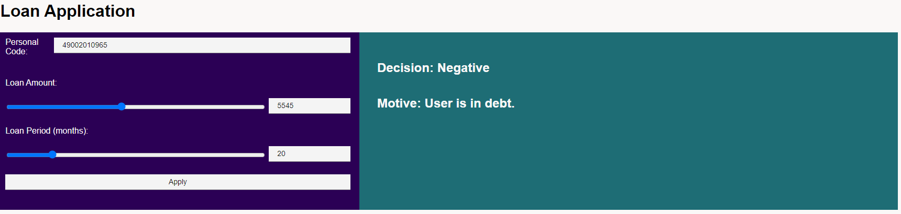

# Inbank Software Engineer Intern - assignment
### Alejandro Ballesteros - 03/2023

## Important
Link after program exec: http://localhost:8080/loan

Hardcoded Users
```sh
49002010965 | segment 0 (debt)
49002010976 | segment 1 (credit modifier: 100)
49002010987 | segment 2 (credit modifier: 300)
49002010998 | segment 3 (credit modifier: 1000)
```
## Folders/Files

- Controller: Web Controller
   - LoanApplicationController: Handles the single api endpoint
- Entity: Classes used in the web service
   - User: Has Personal Code and Segment. Segment is used to get credit modifier.
   - LoanApplication: Form that is sent to later get the decision.
   - LoanApplicationResult: Decision after the form has been processed by the decision engine
- Repository: Database
   - UserExamples: Hardcoded Users. Four in total, one for each segment required.
- Service: Implementation of Services
   - LoanEngine: Where Decision Engine is implemented. Input a LoanApplication. Output a LoanApplicationResult
- Resources: Web design
  - CSS: main.css 
  - JS: main.js
  - HTML: loanApplicationForm.html

## Task Solving  

By reordering the given algorithm, it is possible to obtain the max amount of money that can be given in the loanPeriod. This is possible because the max amount of money that can be obtained is given when the credit score is 1, or the closest to 1 as possible from positive numbers. By replacing credit score for 1 in the algorithm and solving for the loan amount we will get the maximum loan amount.

Given Algorithm

> credit score = (credit modifier / loan amount) * loan period

Reordering
> loan amount * credit score = ((credit modifier / loan amount) * loan period) * loan amount

> loan amount * credit score = credit modifier * loan amount

> loan amount = (credit modifier * loan amount) / credit score

> loan amount = (credit modifier * loan amount) / 1

> loan amount = credit modifier * loan period

If the max loan amount surpasses or is equal the requested amount, then max loan is returned with positive decision.
If max loan is lower than requested, then loan Period increases by 1 and generates a new max Loan until it finds a suitable maxLoan bigger that requested Loan. If there us no suitable loan, it returns a negative decision.

## Example Images

### User is in Debt

### Loan is directly accepted

### Requested Loan is not accepted but a new one is suitable


### No suitable loan is found

